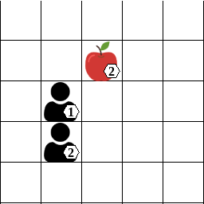
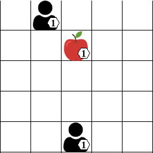

# CQL and IQL on Prisoner's Dilemma and Level-Based Foraging

This repository provides an implementation of two popular reinforcement learning algorithms, **Conservative Q-Learning (CQL)** and **Independent Q-Learning (IQL)**, applied to two distinct multi-agent environments: the classic **Prisoner's Dilemma (PD)** matrix game and the more complex **Level-Based Foraging (LBF)** environment.

## Sample Demonstrations

Here are some sample demonstrations of the agents learning in the Level-Based Foraging environment (non-cooperative version):

### IQL Demo


### CQL Demo


## Description

This project serves as a practical demonstration of how CQL and IQL can be used to train agents in both cooperative and competitive scenarios.

*   **Prisoner's Dilemma (PD):** A classic game theory problem that demonstrates the conflict between individual and collective rationality. This environment is implemented as a matrix game.
*   **Level-Based Foraging (LBF):** A grid-world environment where agents must coordinate to collect food. This environment is more complex and requires agents to learn spatial coordination.

The repository includes scripts for training and evaluating both CQL and IQL on both environments.

## Installation

To run the scripts in this repository, you need to install the required Python packages.

1.  **Clone the repository:**
    ```bash
    git clone https://github.com/your-username/MARL-PD-LBF.git
    cd MARL-PD-LBF
    ```

2.  **Install the requirements:**
    ```bash
    pip install -r requirements.txt
    ```

3.  **Install the Level-Based Foraging environment:**
    ```bash
    pip install lbforaging
    ```

## Usage

This repository provides scripts for training and evaluating the implemented algorithms on the two environments.

### Prisoner's Dilemma (PD)

To train CQL or IQL on the Prisoner's Dilemma environment, use the `train_cql.py` or `train_iql.py` scripts, respectively.

*   **Train IQL on PD:**
    ```bash
    python train_iql.py
    ```

*   **Train CQL on PD:**
    ```bash
    python train_cql.py
    ```

These scripts will train the agents and generate plots showing the convergence of the Q-values and the evaluation returns.

### Level-Based Foraging (LBF)

To run both IQL and CQL sequentially on the Level-Based Foraging environment, use the `lbforaging_game.py` script.

```bash
python lbforaging_game.py
```

This script will train both algorithms and generate the following outputs:

*   **Convergence plots:** For each algorithm, a plot showing the convergence of the average return over training episodes.
*   **Q-value evolution plots:** For each algorithm, a plot showing the evolution of the top-k Q-values over training episodes.
*   **Demonstration GIFs:** For each algorithm, a GIF demonstrating the learned policy in the LBF environment.

#### Cooperative vs. Non-Cooperative LBF

The `lbforaging_game.py` script can be run in either a cooperative or non-cooperative version of the LBF environment. The version of the game is controlled by the environment name in the script.

*   **Non-cooperative:** The default environment is `Foraging-5x5-2p-1f-v2`. The demo videos ending in `_demo.gif` are from this version.
*   **Cooperative:** To switch to the cooperative version, you need to manually change the environment name in `lbforaging_game.py` to `Foraging-5x5-2p-1f-coop-v2`. The demo videos ending in `_demov2.gif` are from this version.

To switch to the cooperative environment, open `lbforaging_game.py` and change the following line:

```python
env = gym.make("Foraging-5x5-2p-1f-v2", render_mode="rgb_array")
```

to:

```python
env = gym.make("Foraging-5x5-2p-1f-coop-v2", render_mode="rgb_array")
```

## Videos

The `videos` directory contains demonstration GIFs of the learned policies for both IQL and CQL in the LBF environment.

*   `IQL_demo.gif` and `CQL_demo.gif`: Demonstrations from the non-cooperative version of the LBF game.
*   `IQL_demov2.gif` and `CQL_demov2.gif`: Demonstrations from the cooperative version of the LBF game.
